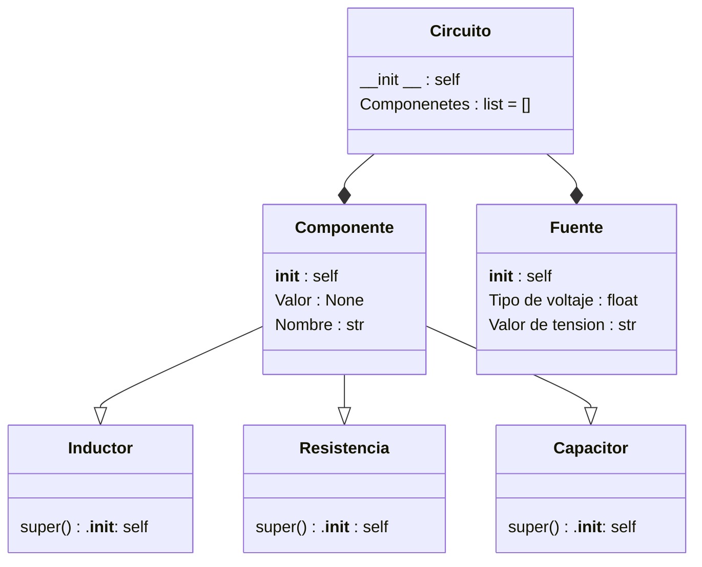

# Proyecto-circuitos
## Diagrama de clases

```mermaid
classDiagram

Componente --|> Inductor
Componente --|> Resistencia
Componente --|> Capacitor

Circuito --* Componente 
Circuito --* Fuente 

class Componente {
    __init__ : self
    Valor : None
    Nombre : str
}

class Resistencia {
    super().__init__ : self
}

class Inductor {
    super().__init__: self
}

class Capacitor {
    super().__init__: self
}

class Fuente {
    __init__ : self
    Tipo de voltaje : float
    Valor de tension : str
}

class Circuito {
    __init __ : self
    Componenetes : list = []
}
```
