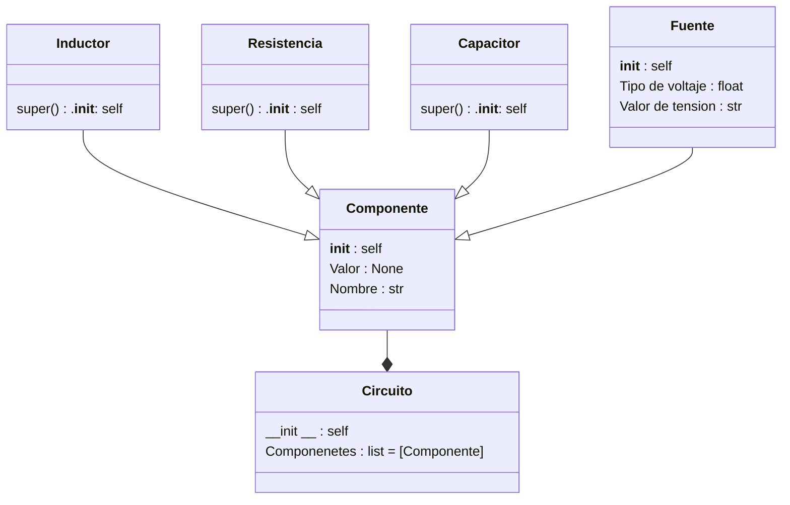

# Proyecto final - Eli y sus testigos
Para reflejar los aprendizajes adquiridos durante el curso de POO, se nos ha encargado la realización de un proyecto final, nuestro grupo **_Eli y sus testigos_** ha escogido de entre las alternativas propuestas la alternativa número 4.

## Definicion de alternativa
La alterativa número 4 tiene como objetivo desarrollar una aplicación en Python que permita simular circuitos RC, RL, RLC simples.

Las condiciones principales de esta alternativa son las siguientes:
 + Código original
 + Uso de herramientas vistas en el curso (CLASES) - Los componentes deben aplicar el enfoque de POO (e.g una Resistencia debe tener atributos como: resistividad, potencia, etc)
 + Se deben poder configurar los componentes en serie y en paralelo
 + Se deben trabajar con fuentes de tensión en DC unicamente
 + El resultado de la simulación deben ser las gráficas de tensión/corriente en cada uno de los componentes 
 + Se pueden utilizar módulos externos para la solución de los componentes númericos

Como caracteristica extra la alternativa propone hacer analisis en el dominio AC.

## Diagrama de clase
Las clases propuestas para el desarrollo de la alternativa son las siguientes:

## Solución preliminar
Para el desarrollo de la alternativa se propuso el patron de aquitectura MVC con el uso de clases separadas por paquetes.
```bash
└── Circuitos_la_pelicula
    └── Controller
       ├── __init__.py
    └── Model
       └── Circuit
       ├── __init__.py
       ├── Circuito.py
       └── Components
       ├── __init__.py
       ├── Componente.py
       ├── Condensador.py
       ├── Fuente.py
       ├── Inductor.py
       ├── Resistencia.py
    └── GUI
       ├── __init__.py
├── main.py
```
