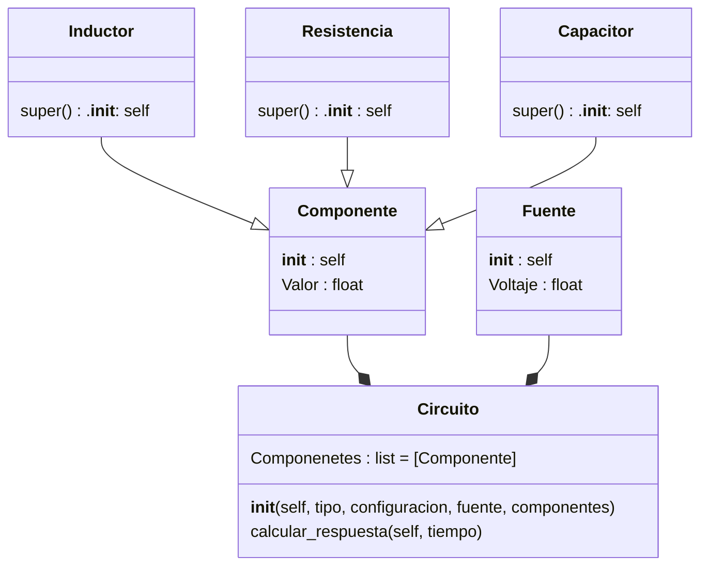

# Proyecto final - Eli y sus testigos
Para reflejar los aprendizajes adquiridos durante el curso de POO, se nos ha encargado la realización de un proyecto final, nuestro grupo **_Eli y sus testigos_** ha escogido de entre las alternativas propuestas la alternativa número 4.

## Definicion de alternativa
La alterativa número cuatro tiene como objetivo desarrollar una aplicación en Python que permita simular circuitos RC, RL, RLC simples.

Las condiciones principales de esta alternativa son las siguientes:
 + Código original
 + Uso de herramientas vistas en el curso (CLASES) - Los componentes deben aplicar el enfoque de POO (e.g una Resistencia debe tener atributos como: resistividad, potencia, etc)
 + Se deben poder configurar los componentes en serie y en paralelo
 + Se deben trabajar con fuentes de tensión en DC unicamente
 + El resultado de la simulación deben ser las gráficas de tensión/corriente en cada uno de los componentes 
 + Se pueden utilizar módulos externos para la solución de los componentes númericos

Como caracteristica extra la alternativa propone hacer analisis en el dominio AC, sin embargo no se implemento en la solución por inconvenientes de tiempo.

## Diagrama de clase
Las clases propuestas para el desarrollo de la alternativa son las siguientes:

## Definición de la solución
Para el desarrollo de la alternativa se propuso organizar el código utilizando paquetes, utilizando el patron de aquitectura MVC (Model - Vista - Controller) con el uso de clases separadas por paquetes.

La estructura de paquetes popuesta para el desarrollo de la solución es la siguiente:

```bash
simulador_circuitos/ # Directorio principal del proyecto
│
├── controladores/ # Paquete que contiene el controlador del programa
│   └── controlador_circuito.py # Modulo que contiene el código del controlador
│
├── modelos/ # Paquete que contiene el modelo del programa
│   ├── componente.py # Modulo que contiene las clases Componente, Inductancia, Capacitancia y Resistencia
│   ├── fuente.py # Modulo que contiene la clase Fuente
│   └── circuito.py  # Paquete que contiene el archivo de la clase Circuito
│
├── vistas/ # Paquete que contiene la vista del progarma
│   ├── vista_circuito.py # Modulo que contiene la interfaz gráfica de usuario
│   ├── vista_grafica.py # Modulo que contiene el código que permite graficar las graficas de
|                          tensión/corriente
│   └── imagenes/  # Carpeta que contiene las imágenes del proyecto
│       ├── RC_serie.png
│       ├── RC_paralelo.png
│       ├── RL_serie.png
│       ├── RL_paralelo.png
│       ├── RLC_serie.png
│       └── RLC_paralelo.png
│
└── main.py # Archivo desde el que se va a ejecutar el programa
```
Para el desarrollo de la solucion se utilizaron las siguientes librerias:
- Tkinter

Esta libreria se utilizo para diseñar la GUI del programa utilizando la libreria `ttk` de Tkinter ya que brinda un mayor control entre el comportamiento de un widget y el código que implementa su apariencia, además de mejoras visuales en el estilo de los widgets con respecto a `tk`.

- Numpy

La libreria se incluyo dentro del proyecto para realizar cálculos numéricos dentro de la clase `Circuito` y generar el intervalo de tiempo a simular.
 
- Matplotlib

Matplotlib se utilizo para generar las graficas de tensión/corriente para cada uno de los circuitos (RL, RC y RLC), teniendo en cuenta si el circuito a simular esta en serie o paralelo
que se entregan como resultado de la simulación.

- OS

La libreria `OS`se utilizo para gestionar de mejor manera la carga de imagenes dentro el programa y evitar errores al acceder a rutas de las imagenes ejecutando el programa
desde otros equipos.

- PIL

PIL o pillow es una libreria que brinda soporte para abrir, manipular y guardar muchos formatos de archivo de imagen diferentes, en el caso de nuestro proyecto se utilizo debido a
que las imagenes utilizan transparencia por lo que la libreria permite gestionar de mejor manera su comportamiento.

## Ejemplo de uso del simulador
Al ingresar al simulador se abre una interfaz con las entradas corespondientes a los datos de los componentes que integran el circuito a simular junto con el tiempo de simulación y las configuraciones del circuito, luego de llenar las entradas con los datos y se presione el boton de graficar se devolvera como resultado la grafica de tension/corriende de cada componenete, el uso del programa se encuentra ilustrado en el siguiente video.

https://github.com/user-attachments/assets/768b299d-d88e-4af9-a102-26a02048b199

