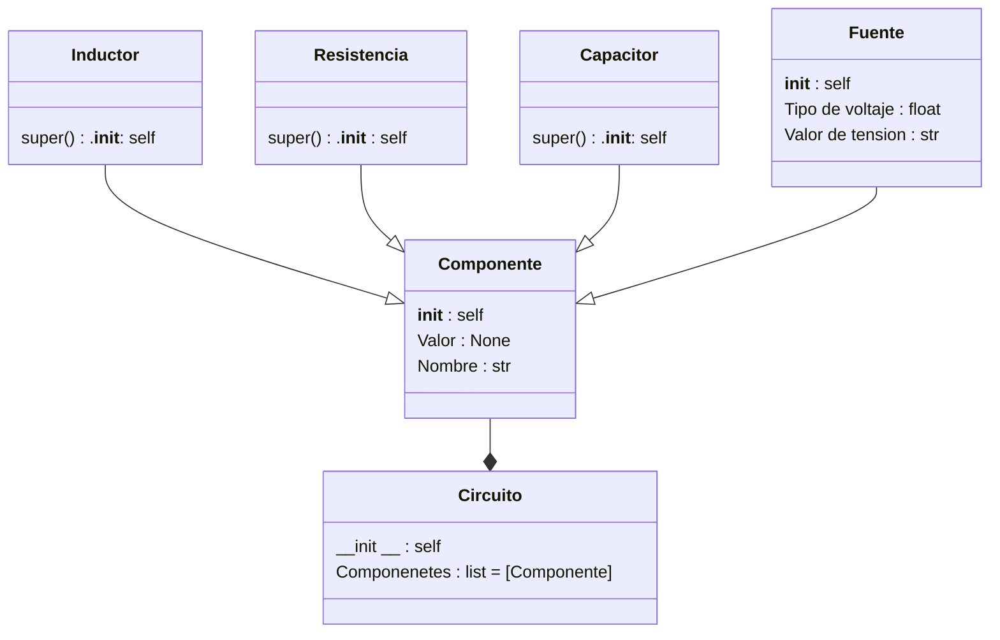

# Proyecto final - Eli y sus testigos
Para reflejar los aprendizajes adquiridos durante el curso de POO, se nos ha encargado la realización de un proyecto final, nuestro grupo **_Eli y sus testigos_** ha escogido de entre las alternativas propuestas la alternativa número 4.

## Definicion de alternativa
La alterativa número cuatro tiene como objetivo desarrollar una aplicación en Python que permita simular circuitos RC, RL, RLC simples.

Las condiciones principales de esta alternativa son las siguientes:
 + Código original
 + Uso de herramientas vistas en el curso (CLASES) - Los componentes deben aplicar el enfoque de POO (e.g una Resistencia debe tener atributos como: resistividad, potencia, etc)
 + Se deben poder configurar los componentes en serie y en paralelo
 + Se deben trabajar con fuentes de tensión en DC unicamente
 + El resultado de la simulación deben ser las gráficas de tensión/corriente en cada uno de los componentes 
 + Se pueden utilizar módulos externos para la solución de los componentes númericos

Como caracteristica extra la alternativa propone hacer analisis en el dominio AC.

## Diagrama de clase
Las clases propuestas para el desarrollo de la alternativa son las siguientes:

## Solución preliminar
Para el desarrollo de la alternativa se propuso organizar el desarrollo en las siguientes fases:

+ Creación del diagrama de clases
+ Implementación del código en Python
+ Testeo de la implementación
+ Creación de la GUI
+ Implementación del código en Python de la simulación
+ Pruebas del programa

Además de esto se planteo el uso de un patron de aquitectura MVC (Model - Vista - Controller) con el uso de clases separadas por paquetes.

```bash
└── Circuitos_la_pelicula # Directorio principal del proyecto
    └── Controller # Paquete que contiene el controlador del programa
       ├── __init__.py
       ├── controller.py # Modulo que contiene el código del controlador

    └── Model # Paquete que contiene el modelo del programa
           └── Circuit # Paquete que contiene el archivo de la clase Circuito
           ├── __init__.py
           ├── Circuito.py # Modulo que contiene la clase Circuito
           └── Components # Paquete que contiene los archivos que corresponden a los componenetes del circuito
           ├── __init__.py 
           ├── Componente.py # Modulo que contiene la clase Componente
           ├── Condensador.py # Modulo aue contiene la clase Capacitor
           ├── Fuente.py # Modulo que contiene la clase Fuente
           ├── Inductor.py # Modulo que contiene la clase Inductor
           ├── Resistencia.py # Modulo que contiene la clase Resistencia

     └── GUI # Paquete que contiene la vista del progarma
            ├── __init__.py
            ├── vista.py # Archivo que contiene la interfaz gráfica de usuario
├── main.py # Archivo desde el que se va a ejecutar el programa
```
